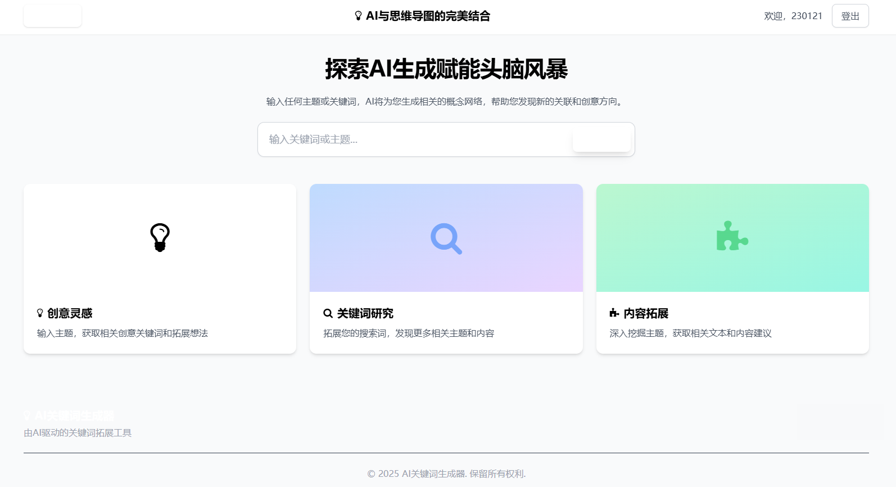
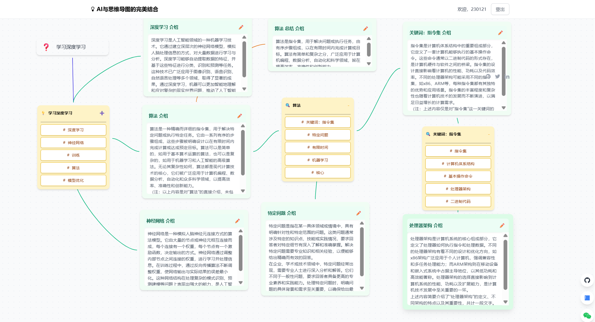

# ThinkGenius - AI 思维导图

ThinkGenius 是一款将大型语言模型（LLM）的强大功能与思维导图和白板等可视化工具相结合的 AI 智能工具，旨在超越传统的文本聊天，增强您的思考、学习和创作过程。





## ✨ 功能亮点

- **AI 驱动的头脑风暴**：输入一个主题，AI 将为您生成相关的概念和关键词网络。
- **动态画布**：在一个无限、可拖动的画布上自由组织您的想法。
- **智能布局**：块之间会自动避让，保持画布整洁有序。
- **智能连接线**：连接线会自动寻找最佳锚点，清晰地展示块之间的关系。
- **内容生成**：点击任何关键词，AI 即可生成详细的介绍或总结。
- **用户认证**：安全可靠的用户注册和登录功能。
- **响应式设计**：在不同设备上均有良好体验。

## 🛠️ 技术栈

- **前端**:
  - [Vue 3](https://vuejs.org/)
  - [Vite](https://vitejs.dev/)
  - [Tailwind CSS](https://tailwindcss.com/)
  - [Markdown-it](https://github.com/markdown-it/markdown-it)
  - [Axios](https://axios-http.com/)

- **后端**:
  - [Java 17](https://www.oracle.com/java/technologies/javase/jdk17-archive-downloads.html)
  - [Spring Boot 3](https://spring.io/projects/spring-boot)
  - [Maven](https://maven.apache.org/)
  - [Spring Security](https://spring.io/projects/spring-security)
  - [JWT (Java Web Token)](https://jwt.io/)

- **数据库**:
  - [MongoDB](https://www.mongodb.com/)

## 📂 项目结构

```
ThinkGenius2/
├── backend/         # Java Spring Boot 后端
│   ├── src/
│   └── pom.xml
├── docs/            # 项目文档
│   ├── API.md
│   ├── ALGORITHM.md
│   └── images/
├── frontend/        # Vue.js 前端
│   ├── src/
│   └── package.json
└── README.md        # 本文档
```

## 🚀 快速开始

### 先决条件

- [Node.js](https://nodejs.org/) (v16+)
- [JDK 17](https://www.oracle.com/java/technologies/javase/jdk17-archive-downloads.html)
- [Maven](https://maven.apache.org/download.cgi)
- [MongoDB](https://www.mongodb.com/try/download/community)

### 后端启动

1. **进入后端目录**:
   ```bash
   cd backend
   ```

2. **安装依赖**:
   ```bash
   mvn install
   ```

3. **配置 `application.yml`**:
   - 打开 `src/main/resources/application.yml`
   - 根据需要修改 `server.port`。
   - 配置你的百度千帆 API Key 和 Secret Key。

4. **启动后端服务**:
   ```bash
   mvn spring-boot:run
   ```
   后端服务将在 `http://localhost:8081` (或你配置的端口) 启动。

### 前端启动

1. **进入前端目录**:
   ```bash
   cd frontend
   ```

2. **安装依赖**:
   ```bash
   npm install
   ```

3. **启动开发服务器**:
   ```bash
   npm run dev
   ```
   前端应用将在 `http://localhost:3000` 启动，并自动代理 API 请求到后端。

## 📚 详细文档

- [**API 文档**](./docs/API.md): 了解所有后端 API 的详细信息。
- [**算法文档**](./docs/ALGORITHM.md): 深入了解画布布局和连接线算法。
- [**数据库文档**](./docs/DATABASE.md): 查看数据库的集合和结构。

---

感谢使用 ThinkGenius！ 