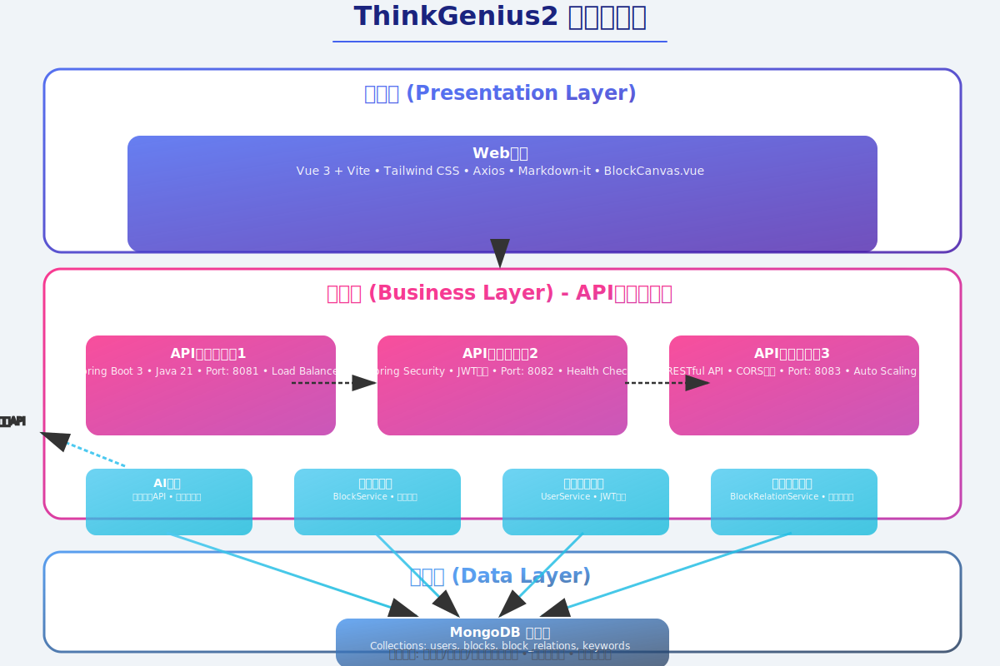

# ThinkGenius2 系统架构文档

## 概述

ThinkGenius2 采用经典的三层架构设计，结合微服务理念，构建了一个可扩展、高性能的AI思维导图系统。



## 架构层次

### 1. 展示层 (Presentation Layer)

展示层负责用户界面的展示和用户交互，支持多种客户端。

#### 1.1 Web前端
- **技术栈**: Vue 3 + Vite + Tailwind CSS
- **主要组件**:
  - `App.vue`: 主应用组件
  - `BlockCanvas.vue`: 画布组件，核心交互界面
  - `UserAuth.vue`: 用户认证组件
- **功能特性**:
  - 响应式设计，支持多种屏幕尺寸
  - 实时画布交互
  - 拖拽和缩放功能
  - 智能布局算法可视化

#### 1.2 移动端App
- **技术栈**: React Native / Flutter
- **功能特性**:
  - 原生移动端体验
  - 触摸手势支持
  - 离线缓存
  - 推送通知

### 2. 业务层 (Business Layer)

业务层采用API服务器集群架构，提供高可用性和可扩展性。

#### 2.1 API服务器集群

**节点1 - 负载均衡器**
- **端口**: 8081
- **职责**: 请求分发、负载均衡
- **技术**: Spring Boot 3 + Java 21

**节点2 - 认证服务**
- **端口**: 8082
- **职责**: 用户认证、JWT管理
- **技术**: Spring Security + JWT

**节点3 - 业务服务**
- **端口**: 8083
- **职责**: 核心业务逻辑、自动扩缩容
- **技术**: RESTful API + CORS支持

#### 2.2 核心服务模块

**AI服务 (AIService)**
- 集成百度千帆API
- 关键词生成
- 内容分析和总结
- 智能问答

**块管理服务 (BlockService)**
- 块的CRUD操作
- 智能位置算法
- 碰撞检测
- 自动布局

**用户认证服务 (UserService)**
- 用户注册和登录
- JWT令牌管理
- 权限控制
- 用户信息管理

**关系管理服务 (BlockRelationService)**
- 块之间的关系管理
- 连接线算法
- 关系可视化
- 关系分析

### 3. 数据层 (Data Layer)

#### 3.1 MongoDB数据库

**集合设计**:
- `users`: 用户信息
- `blocks`: 块数据
- `block_relations`: 块关系
- `keywords`: 关键词数据

**数据特点**:
- 文档型数据库，适合复杂数据结构
- 支持地理空间查询
- 高性能读写
- 水平扩展能力

## 数据流向

### 1. 用户请求流程
```
用户 → 负载均衡器 → API服务器 → 业务服务 → 数据库
```

### 2. AI服务调用流程
```
用户输入 → AI服务 → 百度千帆API → 结果处理 → 返回用户
```

### 3. 数据同步流程
```
前端操作 → API调用 → 数据库更新 → 实时同步 → 其他客户端
```

## 技术特性

### 1. 高可用性
- API服务器集群，支持故障转移
- 负载均衡，避免单点故障
- 健康检查，自动故障检测

### 2. 可扩展性
- 微服务架构，支持独立扩展
- 水平扩展能力
- 模块化设计

### 3. 安全性
- JWT认证机制
- Spring Security安全框架
- CORS跨域保护
- 输入验证和过滤

### 4. 性能优化
- 连接池管理
- 缓存策略
- 异步处理
- 数据库索引优化

## 部署架构

### 开发环境
- 单机部署
- 本地MongoDB
- 开发工具集成

### 生产环境
- 容器化部署 (Docker)
- 云数据库
- 负载均衡器
- 监控和日志系统

## 扩展计划

### 短期目标
- 移动端App开发
- 实时协作功能
- 性能优化

### 长期目标
- 微服务拆分
- 消息队列集成
- 分布式缓存
- 多租户支持

## 监控和维护

### 监控指标
- API响应时间
- 服务器资源使用率
- 数据库性能
- 用户活跃度

### 日志管理
- 结构化日志
- 错误追踪
- 性能分析
- 安全审计

---

*本文档与系统架构图配合使用，提供完整的架构设计说明。* 