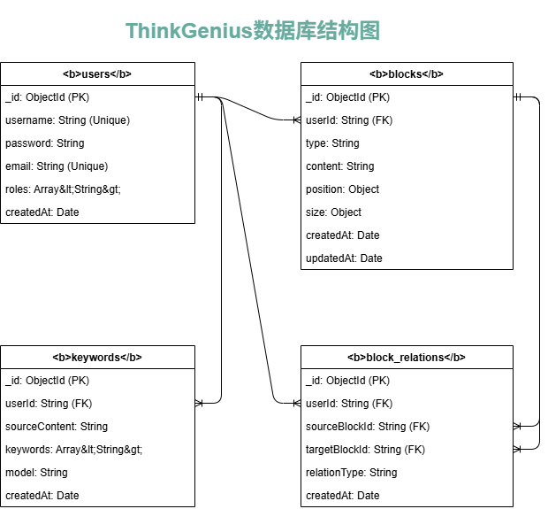

# 数据库文档

本文档详细描述了 ThinkGenius 项目使用的 MongoDB 数据库结构。

## 概述

我们使用 MongoDB 是因为它灵活的文档模型非常适合存储思维导图中的非结构化和半结构化数据，如块（Blocks）和它们之间的关系。

## 集合 (Collections)

### 1. `users`

存储用户信息和认证凭据。

| 字段名 | 类型 | 描述 |
| :--- | :--- | :--- |
| `_id` | `ObjectId` | 用户的唯一标识符。 |
| `username` | `String` | **唯一**, 用于登录的用户名。 |
| `password` | `String` | 经过 BCrypt 加密的密码哈希。 |
| `email` | `String` | **唯一**, 用户的邮箱地址。 |
| `roles` | `Array<String>` | 用户的角色列表，例如 `["ROLE_USER"]`。 |
| `createdAt` | `Date` | 账户创建时间。 |

**索引**:
- `username`: 唯一索引，加速登录查询。
- `email`: 唯一索引，确保邮箱唯一性。

---

### 2. `blocks`

存储画布上所有的"块"信息，包括问题、关键词和文本块。

| 字段名 | 类型 | 描述 |
| :--- | :--- | :--- |
| `_id` | `ObjectId` | 块的唯一标识符。 |
| `userId` | `String` | **索引**, 关联到创建该块的用户 `_id`。 |
| `type` | `String` | 块的类型，如 `question`, `keyword`, `text`。 |
| `content` | `String` | 块的主要文本内容（问题、介绍等）。 |
| `position` | `Object` | 块在画布上的绝对位置。 |
| `position.x`| `Double` | X 坐标。 |
| `position.y`| `Double` | Y 坐标。 |
| `size` | `Object` | 块的尺寸。 |
| `size.width`| `Double` | 宽度。 |
| `size.height`| `Double` | 高度。 |
| `createdAt` | `Date` | 块的创建时间。 |
| `updatedAt` | `Date` | 块的最后更新时间。 |

**索引**:
- `userId`: 加速按用户查询所有块。

---

### 3. `block_relations`

存储块与块之间的关系，用于绘制连接线。

| 字段名 | 类型 | 描述 |
| :--- | :--- | :--- |
| `_id` | `ObjectId` | 关系的唯一标识符。 |
| `userId` | `String` | **索引**, 关联到创建该关系的用户 `_id`。 |
| `sourceBlockId` | `String` | **索引**, 起点块的 `_id`。 |
| `targetBlockId` | `String` | **索引**, 终点块的 `_id`。 |
| `relationType`| `String` | 关系类型，如 `parent`, `related`, `summary`。 |
| `createdAt` | `Date` | 关系的创建时间。 |

**索引**:
- `userId`
- `sourceBlockId`
- `targetBlockId`

---

### 4. `keywords`

存储由 AI 生成的关键词，以及它们与源内容的关联。

| 字段名 | 类型 | 描述 |
| :--- | :--- | :--- |
| `_id` | `ObjectId` | 关键词记录的唯一标识符。 |
| `userId` | `String` | **索引**, 关联到用户 `_id`。 |
| `sourceContent`| `String` | 用于生成这些关键词的原始内容。 |
| `keywords` | `Array<String>` | 由 AI 生成的关键词列表。 |
| `model` | `String` | 生成这些关键词时使用的 AI 模型（例如 `ernie-4.0-8k`）。 |
| `createdAt` | `Date` | 记录的创建时间。 |

**索引**:
- `userId` 